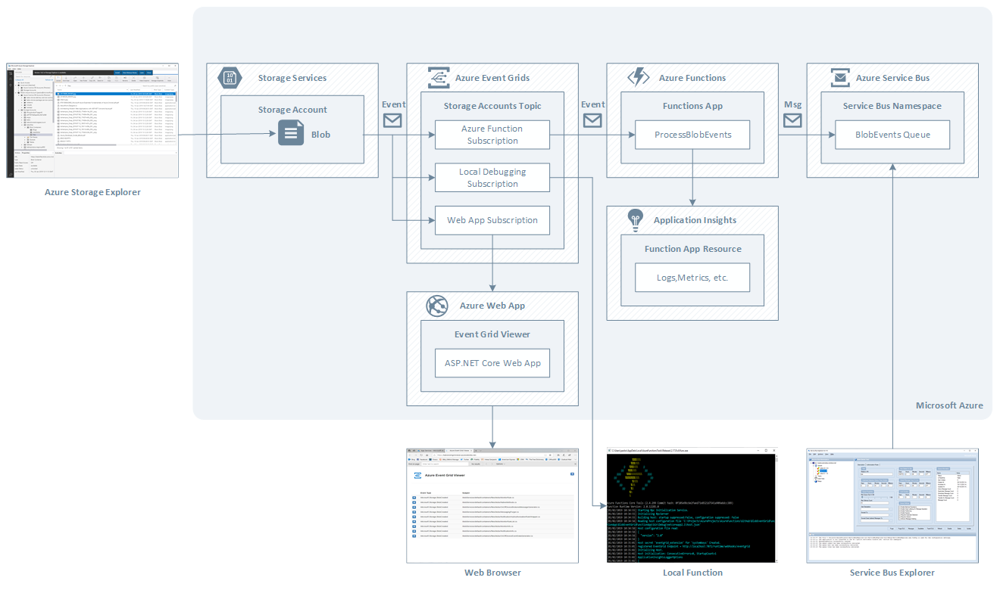
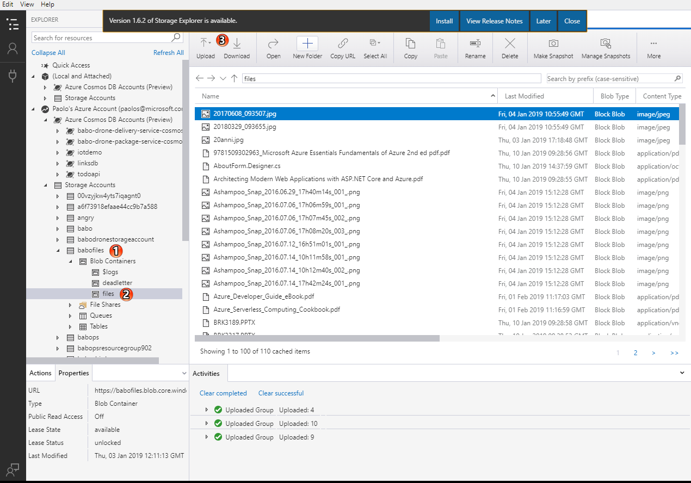
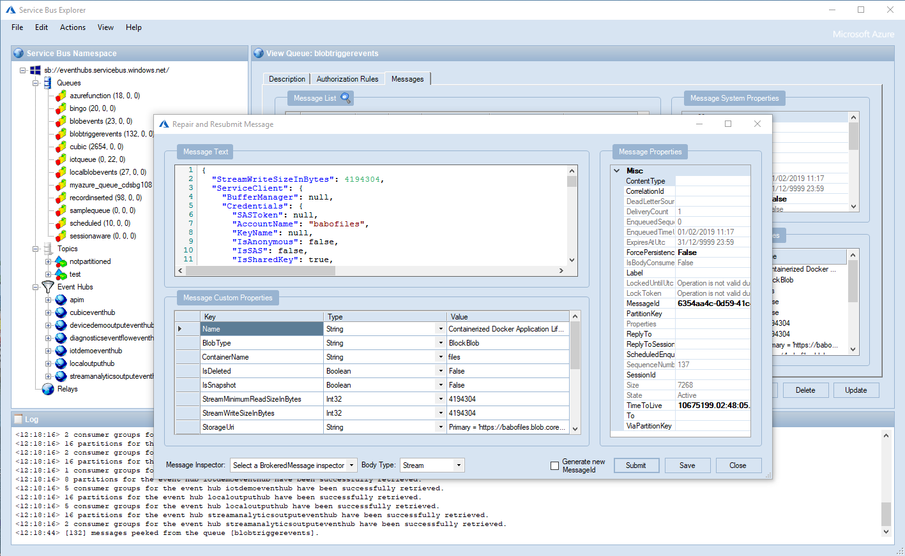
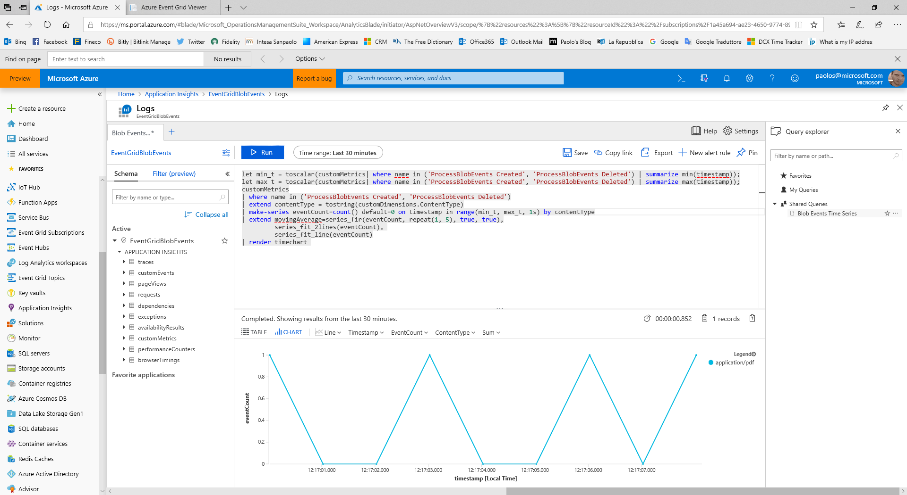

## Introduction
This sample demonstrates how to create a serverless application to receive and process events via an Azure Event Grid Subscription any time a blob is created, updated or deleted in a given container inside an [Azure storage account](https://docs.microsoft.com/en-us/azure/storage/common/storage-account-overview).

## What is Azure Event Grid?
[Azure Event Grid](https://docs.microsoft.com/en-us/azure/event-grid/overview) is a fully-managed intelligent event routing service that allows for uniform event consumption using a publish-subscribe model. Azure Event Grid allows you to easily build event-processging applications using a microservice and serverless architecture. The Azure Event Grid support a rich set of publishers and consumers. A publisher is the service or resource that originates the event. For example, an Azure blob storage account is a publisher, and a blob upload or deletion is an event. Some Azure services have built-in support for publishing events to Event Grid.


## Publishers or Event Sources
For full details on the capabilities of each event publisher as well as related articles, see [event sources](https://docs.microsoft.com/en-us/azure/event-grid/event-sources). Currently, the following Azure services support sending events to Event Grid:

- Azure Subscriptions (management operations)
- Container Registry
- Custom Topics
- Event Hubs
- IoT Hub
- Media Services
- Resource Groups (management operations)
- Service Bus
- Storage Blob
- Storage General-purpose v2 (GPv2)

## Event Handlers or Consumers
For full details on the capabilities of each event consumer as well as related articles, see [event handlers](https://docs.microsoft.com/en-us/azure/event-grid/event-handlers). Currently, the following Azure services support handling events from Event Grid:

- Azure Automation
- Azure Functions
- Event Hubs
- Hybrid Connections
- Logic Apps
- Microsoft Flow
- Queue Storage
- WebHooks

## Architecture
The following picture shows the architecture design of the application.



## Message Flow
1. Use the [Azure Storage Explorer](https://azure.microsoft.com/en-us/features/storage-explorer/) to upload one more files as blobs to a container in an Azure storage account.
2. The Azure Storage Account Topic sends an event to 3 Azure Event Grid Subscriptions:
	- Azure Function Subscription: this subscription is configured to send events to the webhook endpoint exposed by an Azure Function that makes use of [Event Grid trigger for Azure Functions](https://docs.microsoft.com/en-us/azure/azure-functions/functions-bindings-event-grid)
	- Local Debugging Subscription: this subscription is configured to send events to a local function on your via a public HTTP/S endpoint exposed by [ngrok](https://ngrok.com/) on your development machine. For more information, see [Azure Function Event Grid Trigger Local Debugging](https://docs.microsoft.com/en-us/azure/azure-functions/functions-debug-event-grid-trigger-local).
	- Azure Event Grid Viewer: this subscription is configured to send events to a pre-built Azure Web App that displays the event messages. For more information on how to use this web app to see the events generated by an Azure Event Grid Topic, see [Azure Event Grid Viewer](https://github.com/Azure-Samples/azure-event-grid-viewer). For more information on how to send storage events to a web endpoint with Azure CLI, see the [Quickstart: Route storage events to web endpoint with Azure CLI](https://docs.microsoft.com/en-us/azure/storage/blobs/storage-blob-event-quickstart).
3. An Azure Function uses the [Event Grid trigger for Azure Functions](https://docs.microsoft.com/en-us/azure/azure-functions/functions-bindings-event-grid) to receive events via an Event Grid Subscription and send events to a queue in a Service Bus namespace. You can use the [Service Bus Explorer](https://github.com/paolosalvatori/ServiceBusExplorer) to receive or peek messages from the queue. The Azure Function is instrumented to collect and send metrics and logs to Application Insights.

## Blob Trigger vs Event Grid Trigger
The [Blob storage trigger](https://docs.microsoft.com/en-us/azure/azure-functions/functions-bindings-storage-blob#trigger) starts a function when a new or updated blob is detected. The blob contents are provided as input to the function. The [Event Grid](https://docs.microsoft.com/en-us/azure/azure-functions/functions-bindings-event-grid) trigger has built-in support for blob events and can also be used to start a function when a new or updated blob is detected. When using the Blob storage trigger, you can directly access the content of the new or updated blob.
Use Event Grid instead of the Blob storage trigger for the following scenarios:
* Blob storage accounts: Blob storage accounts are supported for blob input and output bindings 
  but not for blob triggers. Blob storage triggers require a general-purpose storage account.
* High scale: high scale can be loosely defined as containers that have more than 100,000 blobs 
  in them or storage accounts that have more than 100 blob updates per second.
* Minimizing latency: if your function app is on the Consumption plan, there can be up to a 10-minute delay 
  in processing new blobs if a function app has gone idle. To avoid this latency, you can switch to an App 
  Service plan with Always On enabled. You can also use an Event Grid trigger with your Blob storage account. 
* Blob delete events: you cannot handle blob delete events with the Blob Storage trigger


## Configuration
Make sure to specify the following data in the local.settings.json:

 - [AzureWebJobStorage](https://docs.microsoft.com/en-us/azure/azure-functions/functions-app-settings#azurewebjobsstorage): the Azure Functions runtime uses this storage account connection string for all functions except for HTTP triggered functions.
 - [APPINSIGHTS_INSTRUMENTATIONKEY](https://docs.microsoft.com/en-us/azure/azure-functions/functions-app-settings#appinsightsinstrumentationkey): The Application Insights instrumentation key if you're using Application Insights. For more information, see [Monitor Azure Functions](https://docs.microsoft.com/en-us/azure/azure-functions/functions-monitoring).
 - ServiceBusConnectionString: the connection string of the Service Bus namespace containing the queue where the Azure Function sends messages to.
 - QueueName: the names of the queue.

```elixir
{
	"IsEncrypted": false,
	"Values": {
		"AzureWebJobsStorage": "<storage-account-connection-string>",
		"FUNCTIONS_WORKER_RUNTIME": "dotnet",
		"APPINSIGHTS_INSTRUMENTATIONKEY": "<app-insights-instrumentation-key>",
		"ServiceBusConnectionString": "<service-bus-connection-string>",
		"QueueName": "<queue-name>"
	}
}
```
## Azure Function Code
The following table contains the code of the Azure Function.

```csharp
#region Using Directives
using System;
using System.Threading.Tasks;
using Microsoft.Azure.EventGrid.Models;
using Microsoft.Azure.WebJobs;
using Microsoft.Azure.WebJobs.ServiceBus;
using Microsoft.ApplicationInsights;
using Microsoft.ApplicationInsights.Extensibility;
using Microsoft.Extensions.Logging;
using Microsoft.Azure.ServiceBus;
using System.Text;
using Microsoft.Azure.WebJobs.Extensions.EventGrid;
using Newtonsoft.Json.Linq;
using System.Collections.Generic;
#endregion

namespace BlobEventGridFunctionApp
{
    public static class ProcessBlobEvents
    {
        #region Private Constants
        private const string BlobCreatedEvent = "Microsoft.Storage.BlobCreated";
        private const string BlobDeletedEvent = "Microsoft.Storage.BlobDeleted";
        #endregion

        #region Private Static Fields
        private static readonly string key = TelemetryConfiguration.Active.InstrumentationKey = Environment.GetEnvironmentVariable("APPINSIGHTS_INSTRUMENTATIONKEY", EnvironmentVariableTarget.Process);
        private static readonly TelemetryClient telemetry = new TelemetryClient() { InstrumentationKey = key };
        #endregion

        #region Azure Functions
        [FunctionName("ProcessBlobEvents")]
        public static async Task Run([EventGridTrigger]EventGridEvent eventGridEvent,
                                [ServiceBus("%QueueName%", Connection = "ServiceBusConnectionString", EntityType = EntityType.Queue)] IAsyncCollector<Message> asyncCollector,
                                ExecutionContext context,
                                ILogger log)
        {
            try
            {
                if (eventGridEvent == null && string.IsNullOrWhiteSpace(eventGridEvent.EventType))
                {
                    throw new ArgumentNullException("Null or Invalid Event Grid Event");
                }

                log.LogInformation($@"New Event Grid Event:
    - Id=[{eventGridEvent.Id}]
    - EventType=[{eventGridEvent.EventType}]
    - EventTime=[{eventGridEvent.EventTime}]
    - Subject=[{eventGridEvent.Subject}]
    - Topic=[{eventGridEvent.Topic}]");

                if (eventGridEvent.Data is JObject jObject)
                {
                    // Create message
                    var message = new Message(Encoding.UTF8.GetBytes(jObject.ToString()))
                    {
                        MessageId = eventGridEvent.Id
                    };

                    switch (eventGridEvent.EventType)
                    {
                        case BlobCreatedEvent:
                            {
                                var blobCreatedEvent = jObject.ToObject<StorageBlobCreatedEventData>();
                                var storageDiagnostics = JObject.Parse(blobCreatedEvent.StorageDiagnostics.ToString()).ToString(Newtonsoft.Json.Formatting.None);

                                log.LogInformation($@"Received {BlobCreatedEvent} Event: 
    - Api=[{blobCreatedEvent.Api}]
    - BlobType=[{blobCreatedEvent.BlobType}]
    - ClientRequestId=[{blobCreatedEvent.ClientRequestId}]
    - ContentLength=[{blobCreatedEvent.ContentLength}]
    - ContentType=[{blobCreatedEvent.ContentType}]
    - ETag=[{blobCreatedEvent.ETag}]
    - RequestId=[{blobCreatedEvent.RequestId}]
    - Sequencer=[{blobCreatedEvent.Sequencer}]
    - StorageDiagnostics=[{storageDiagnostics}]
    - Url=[{blobCreatedEvent.Url}]
");

                                // Set message label
                                message.Label = "BlobCreatedEvent";

                                // Add custom properties
                                message.UserProperties.Add("id", eventGridEvent.Id);
                                message.UserProperties.Add("topic", eventGridEvent.Topic);
                                message.UserProperties.Add("eventType", eventGridEvent.EventType);
                                message.UserProperties.Add("eventTime", eventGridEvent.EventTime);
                                message.UserProperties.Add("subject", eventGridEvent.Subject);
                                message.UserProperties.Add("api", blobCreatedEvent.Api);
                                message.UserProperties.Add("blobType", blobCreatedEvent.BlobType);
                                message.UserProperties.Add("clientRequestId", blobCreatedEvent.ClientRequestId);
                                message.UserProperties.Add("contentLength", blobCreatedEvent.ContentLength);
                                message.UserProperties.Add("contentType", blobCreatedEvent.ContentType);
                                message.UserProperties.Add("eTag", blobCreatedEvent.ETag);
                                message.UserProperties.Add("requestId", blobCreatedEvent.RequestId);
                                message.UserProperties.Add("sequencer", blobCreatedEvent.Sequencer);
                                message.UserProperties.Add("storageDiagnostics", storageDiagnostics);
                                message.UserProperties.Add("url", blobCreatedEvent.Url);

                                // Add message to AsyncCollector
                                await asyncCollector.AddAsync(message);

                                // Telemetry
                                telemetry.Context.Operation.Id = context.InvocationId.ToString();
                                telemetry.Context.Operation.Name = "BlobCreatedEvent";
                                telemetry.TrackEvent($"[{blobCreatedEvent.Url}] blob created");
                                var properties = new Dictionary<string, string>
                                {
                                    { "BlobType", blobCreatedEvent.BlobType },
                                    { "ContentType ", blobCreatedEvent.ContentType }
                                };
                                telemetry.TrackMetric("ProcessBlobEvents Created", 1, properties);
                            }
                            break;

                        case BlobDeletedEvent:
                            {
                                var blobDeletedEvent = jObject.ToObject<StorageBlobDeletedEventData>();
                                var storageDiagnostics = JObject.Parse(blobDeletedEvent.StorageDiagnostics.ToString()).ToString(Newtonsoft.Json.Formatting.None);

                                log.LogInformation($@"Received {BlobDeletedEvent} Event: 
    - Api=[{blobDeletedEvent.Api}]
    - BlobType=[{blobDeletedEvent.BlobType}]
    - ClientRequestId=[{blobDeletedEvent.ClientRequestId}]
    - ContentType=[{blobDeletedEvent.ContentType}]
    - RequestId=[{blobDeletedEvent.RequestId}]
    - Sequencer=[{blobDeletedEvent.Sequencer}]
    - StorageDiagnostics=[{storageDiagnostics}]
    - Url=[{blobDeletedEvent.Url}]
");

                                // Set message label
                                message.Label = "BlobDeletedEvent";

                                // Add custom properties
                                message.UserProperties.Add("id", eventGridEvent.Id);
                                message.UserProperties.Add("topic", eventGridEvent.Topic);
                                message.UserProperties.Add("eventType", eventGridEvent.EventType);
                                message.UserProperties.Add("eventTime", eventGridEvent.EventTime);
                                message.UserProperties.Add("subject", eventGridEvent.Subject);
                                message.UserProperties.Add("api", blobDeletedEvent.Api);
                                message.UserProperties.Add("blobType", blobDeletedEvent.BlobType);
                                message.UserProperties.Add("clientRequestId", blobDeletedEvent.ClientRequestId);
                                message.UserProperties.Add("contentType", blobDeletedEvent.ContentType);
                                message.UserProperties.Add("requestId", blobDeletedEvent.RequestId);
                                message.UserProperties.Add("sequencer", blobDeletedEvent.Sequencer);
                                message.UserProperties.Add("storageDiagnostics", storageDiagnostics);
                                message.UserProperties.Add("url", blobDeletedEvent.Url);

                                // Add message to AsyncCollector
                                await asyncCollector.AddAsync(message);

                                // Telemetry
                                telemetry.Context.Operation.Id = context.InvocationId.ToString();
                                telemetry.Context.Operation.Name = "BlobDeletedEvent";
                                telemetry.TrackEvent($"[{blobDeletedEvent.Url}] blob deleted");
                                var properties = new Dictionary<string, string>
                                {
                                    { "BlobType", blobDeletedEvent.BlobType },
                                    { "ContentType ", blobDeletedEvent.ContentType }
                                };
                                telemetry.TrackMetric("ProcessBlobEvents Deleted", 1, properties);
                            }
                            break;
                    }
                }
            }
            catch (Exception ex)
            {
                log.LogError(ex, ex.Message);
                throw;
            }
        } 
        #endregion
    }
}
```

## Scripts
The solution includes 3 bash scripts can be used to create the 3 Azure Event Grid Subscriptions used to send events any time a blob is created, updated or deleted in the files container in the source storage account, respectively to: 

 - Azure Function running on Azure
 - Azure Funtion running in you development machine
 - Event Grid Event Viewer web app on Azure

Make sure to properly assign a value to variables before running the script. Also make sure to run scripts using an Azure AD account that is the owner or a contributor of the Azure subscription where you intend to deploy the solution.

**create-event-grid-subscription-for-azure-function.sh**
```bash
#!/bin/bash

# variables
location="WestEurope"
storageAccountName="babofiles"
storageAccountResourceGroup="BaboFilesResourceGroup"
functionAppName="EventGridBlobEvents"
functionAppResourceGroup="EventGridBlobEventsResourceGroup"
functionName="ProcessBlobEvents"
subscriptionName='BaboFilesAzureFunctionSubscriber'
deadLetterContainerName="deadletter"
filesContainerName="files"
subjectBeginsWith="/blobServices/default/containers/"$filesContainerName

# functions
function getEventGridExtensionKey
{
    # get Kudu username
    echo "Retrieving username from ["$functionAppName"] Azure Function publishing profile..."
    username=$(az functionapp deployment list-publishing-profiles --name $1 --resource-group $2 --query '[?publishMethod==`MSDeploy`].userName' --output tsv)
    
    if [ -n $username ]; then
        echo "["$username"] username successfully retrieved"
    else
        echo "No username could be retrieved"
        return
    fi

    # get Kudu password
    echo "Retrieving password from ["$functionAppName"] Azure Function publishing profile..."
    password=$(az functionapp deployment list-publishing-profiles --name $1 --resource-group $2 --query '[?publishMethod==`MSDeploy`].userPWD' --output tsv)
    
    if [ -n $password ]; then
        echo "["$password"] password successfully retrieved"
    else
        echo "No password could be retrieved"
        return
    fi

    # get jwt
    echo "Retrieving JWT token from Azure Function \ Kudu Management API..."
    jwt=$(sed -e 's/^"//' -e 's/"$//' <<< $(curl https://$functionAppName.scm.azurewebsites.net/api/functions/admin/token --user $username":"$password --silent))

    if [ -n $jwt ]; then
        echo "JWT token successfully retrieved"
    else
        echo "No JWT token could be retrieved"
        return
    fi

    # get eventgrid_extension key
    echo "Retrieving [eventgrid_extension] key..."
    eventGridExtensionKey=$(sed -e 's/^"//' -e 's/"$//' <<< $(curl -H 'Accept: application/json' -H "Authorization: Bearer ${jwt}" https://$functionAppName.azurewebsites.net/admin/host/systemkeys/eventgrid_extension --silent | jq .value))

    if [ -n $eventGridExtensionKey ]; then
        echo "[eventgrid_extension] key successfully retrieved"
    else
        echo "No [eventgrid_extension] key could be retrieved"
        return
    fi
}

# check if the storage account exists
echo "Checking if ["$storageAccountName"] storage account actually exists..."

set +e
(
    az storage account show --name $storageAccountName --resource-group $storageAccountResourceGroup &> /dev/null
)

if [ $? != 0 ]; then
	echo "No ["$storageAccountName"] storage account actually exists"
    set -e
    (
        # create the storage account
        az storage account create \
        --name $storageAccountName \
        --resource-group $storageAccountResourceGroup \
        --location $location \
        --sku Standard_LRS \
        --kind BlobStorage \
        --access-tier Hot 1> /dev/null
    )
    echo "["$storageAccountName"] storage account successfully created"
else
	echo "["$storageAccountName"] storage account already exists"
fi

# get storage account connection string
echo "Retrieving the connection string for ["$storageAccountName"] storage account..."
connectionString=$(az storage account show-connection-string --name $storageAccountName --resource-group $storageAccountResourceGroup --query connectionString --output tsv)

if [ -n $connectionString ]; then
    echo "The connection string for ["$storageAccountName"] storage account is ["$connectionString"]"
else
    echo "Failed to retrieve the connection string for ["$storageAccountName"] storage account"
    return
fi

# checking if deadletter container exists
echo "Checking if ["$deadLetterContainerName"] container already exists..."
set +e
(
    az storage container show --name $deadLetterContainerName --connection-string $connectionString &> /dev/null
)

if [ $? != 0 ]; then
	echo "No ["$deadLetterContainerName"] container actually exists in ["$storageAccountName"] storage account"
    set -e
    (
        # create deadletter container
        az storage container create \
        --name $deadLetterContainerName \
        --public-access off \
        --connection-string $connectionString 1> /dev/null
    )
    echo "["$deadLetterContainerName"] container successfully created in ["$storageAccountName"] storage account"
else
	echo "A container called ["$deadLetterContainerName"] already exists in ["$storageAccountName"] storage account"
fi

# checking if files container exists
echo "Checking if ["$filesContainerName"] container already exists..."
set +e
(
    az storage container show --name $filesContainerName --connection-string $connectionString &> /dev/null
)

if [ $? != 0 ]; then
	echo "No ["$filesContainerName"] container actually exists in ["$storageAccountName"] storage account"
    set -e
    (
        # create files container
        az storage container create \
        --name $filesContainerName \
        --public-access off \
        --connection-string $connectionString 1> /dev/null
    )
    echo "["$filesContainerName"] container successfully created in ["$storageAccountName"] storage account"
else
	echo "A container called ["$filesContainerName"] already exists in ["$storageAccountName"] storage account"
fi

# retrieve resource id for the storage account
echo "Retrieving the resource id for ["$storageAccountName"] storage account..."
storageAccountId=$(az storage account show --name $storageAccountName --resource-group $storageAccountResourceGroup --query id --output tsv 2> /dev/null)

if [ -n $storageAccountId ]; then
    echo "Resource id for ["$storageAccountName"] storage account successfully retrieved: ["$storageAccountId"]"
else
    echo "Failed to retrieve resource id for ["$storageAccountName"] storage account"
    return
fi

# retrieve eventgrid_extensionkey
getEventGridExtensionKey $functionAppName $functionAppResourceGroup

if [ -z $eventGridExtensionKey ]; then
    echo "Failed to retrieve eventgrid_extensionkey"
    return
fi

# creating the endpoint URL for the Azure Function
endpointUrl="https://$functionAppName.azurewebsites.net/runtime/webhooks/eventgrid?functionName=$functionName&code=$eventGridExtensionKey"

echo "The endpoint for the ["$functionName"] function in the ["$functionAppName"] function app is ["$endpointUrl"]"

echo "Checking if Azure CLI eventgrid extension is installed..."
set +e
(
    az extension show --name eventgrid --query name --output tsv &> /dev/null
)

if [ $? != 0 ]; then
	echo "The Azure CLI eventgrid extension was not found. Installing the extension..."
  az extension add --name eventgrid
else
    echo "Azure CLI eventgrid extension successfully found. Updating the extension to the latest version..."
  az extension update --name eventgrid
fi

# checking if the subscription already exists
echo "Checking if ["$subscriptionName"] Event Grid subscription already exists for ["$storageAccountName"] storage account..."
set +e
(
    az eventgrid event-subscription show --name $subscriptionName --source-resource-id $storageAccountId &> /dev/null
)

if [ $? != 0 ]; then
	echo "No ["$subscriptionName"] Event Grid subscription actually exists for ["$storageAccountName"] storage account"
    echo "Creating a subscription for the ["$endpointUrl"] endpoint of the ["$functionName"] Azure Function..."

    set +e
    (
        az eventgrid event-subscription create \
        --source-resource-id $storageAccountId \
        --name $subscriptionName \
        --endpoint-type webhook \
        --endpoint $endpointUrl \
        --subject-begins-with $subjectBeginsWith \
        --deadletter-endpoint $storageAccountId/blobServices/default/containers/$deadLetterContainerName 1> /dev/null
    )

    if [ $? == 0 ]; then
        echo "["$subscriptionName"] Event Grid subscription successfully created"
    fi
else
	echo "An Event Grid subscription called ["$subscriptionName"] already exists for ["$storageAccountName"] storage account"
fi
```

**create-event-grid-subscription-for-local-function.sh**
```bash
#!/bin/bash

# variables
location="WestEurope"
storageAccountName="babofiles"
storageAccountResourceGroup="BaboFilesResourceGroup"
subscriptionName='BaboFilesLocalDebugging'
ngrockSubdomain="db1abac5"
functionName="ProcessBlobEvents"
endpointUrl="https://"$ngrockSubdomain".ngrok.io/runtime/webhooks/EventGrid?functionName="$functionName
deadLetterContainerName="deadletter"
filesContainerName="files"
subjectBeginsWith="/blobServices/default/containers/"$filesContainerName

# check if the storage account exists
echo "Checking if ["$storageAccountName"] storage account actually exists..."

set +e
(
    az storage account show --name $storageAccountName --resource-group $storageAccountResourceGroup &> /dev/null
)

if [ $? != 0 ]; then
	echo "No ["$storageAccountName"] storage account actually exists"
    set -e
    (
        # create the storage account
        az storage account create \
        --name $storageAccountName \
        --resource-group $storageAccountResourceGroup \
        --location $location \
        --sku Standard_LRS \
        --kind BlobStorage \
        --access-tier Hot 1> /dev/null
    )
    echo "["$storageAccountName"] storage account successfully created"
else
	echo "["$storageAccountName"] storage account already exists"
fi

# get storage account connection string
echo "Retrieving the connection string for ["$storageAccountName"] storage account..."
connectionString=$(az storage account show-connection-string --name $storageAccountName --resource-group $storageAccountResourceGroup --query connectionString --output tsv)

if [ -n $connectionString ]; then
    echo "The connection string for ["$storageAccountName"] storage account is ["$connectionString"]"
else
    echo "Failed to retrieve the connection string for ["$storageAccountName"] storage account"
    return
fi

# checking if deadletter container exists
echo "Checking if ["$deadLetterContainerName"] container already exists..."
set +e
(
    az storage container show --name $deadLetterContainerName --connection-string $connectionString &> /dev/null
)

if [ $? != 0 ]; then
	echo "No ["$deadLetterContainerName"] container actually exists in ["$storageAccountName"] storage account"
    set -e
    (
        # create deadletter container
        az storage container create \
        --name $deadLetterContainerName \
        --public-access off \
        --connection-string $connectionString 1> /dev/null
    )
    echo "["$deadLetterContainerName"] container successfully created in ["$storageAccountName"] storage account"
else
	echo "A container called ["$deadLetterContainerName"] already exists in ["$storageAccountName"] storage account"
fi

# checking if files container exists
echo "Checking if ["$filesContainerName"] container already exists..."
set +e
(
    az storage container show --name $filesContainerName --connection-string $connectionString &> /dev/null
)

if [ $? != 0 ]; then
	echo "No ["$filesContainerName"] container actually exists in ["$storageAccountName"] storage account"
    set -e
    (
        # create files container
        az storage container create \
        --name $filesContainerName \
        --public-access off \
        --connection-string $connectionString 1> /dev/null
    )
    echo "["$filesContainerName"] container successfully created in ["$storageAccountName"] storage account"
else
	echo "A container called ["$filesContainerName"] already exists in ["$storageAccountName"] storage account"
fi

# retrieve resource id for the storage account
echo "Retrieving the resource id for ["$storageAccountName"] storage account..."
storageAccountId=$(az storage account show --name $storageAccountName --resource-group $storageAccountResourceGroup --query id --output tsv 2> /dev/null)

if [ -n $storageAccountId ]; then
    echo "Resource id for ["$storageAccountName"] storage account successfully retrieved: ["$storageAccountId"]"
else
    echo "Failed to retrieve resource id for ["$storageAccountName"] storage account"
    return
fi

echo "Checking if Azure CLI eventgrid extension is installed..."
set +e
(
    az extension show --name eventgrid --query name --output tsv &> /dev/null
)

if [ $? != 0 ]; then
	echo "The Azure CLI eventgrid extension was not found. Installing the extension..."
  az extension add --name eventgrid
else
    echo "Azure CLI eventgrid extension successfully found. Updating the extension to the latest version..."
  az extension update --name eventgrid
fi

# checking if the subscription already exists
echo "Checking if ["$subscriptionName"] Event Grid subscription already exists for ["$storageAccountName"] storage account..."
set +e
(
    az eventgrid event-subscription show --name $subscriptionName --source-resource-id $storageAccountId &> /dev/null
)

if [ $? != 0 ]; then
	echo "No ["$subscriptionName"] Event Grid subscription actually exists for ["$storageAccountName"] storage account"
    echo "Creating a subscription for the ["$endpointUrl"] ngrock local endpoint..."

	set +e
	(
		az eventgrid event-subscription create \
        --source-resource-id $storageAccountId \
        --name $subscriptionName \
        --endpoint-type webhook \
        --endpoint $endpointUrl \
        --subject-begins-with $subjectBeginsWith \
        --deadletter-endpoint $storageAccountId/blobServices/default/containers/$deadLetterContainerName 1> /dev/null
	)

    if [ $? == 0 ]; then
        echo "["$subscriptionName"] Event Grid subscription successfully created"
    fi
else
	echo "An Event Grid subscription called ["$subscriptionName"] already exists for ["$storageAccountName"] storage account"
fi
```

**create-event-grid-subscription-for-web-app.sh**
```bash
#!/bin/bash

# variables
location="WestEurope"
storageAccountName="babofiles"
storageAccountResourceGroup="BaboFilesResourceGroup"
subscriptionName='BaboFilesWebApp'
webAppSubdomain="baboeventgridviewer"
functionName="ProcessBlobEvents"
endpointUrl="https://"$webAppSubdomain".azurewebsites.net/api/updates"
deadLetterContainerName="deadletter"
filesContainerName="files"

# check if the storage account exists
echo "Checking if ["$storageAccountName"] storage account actually exists..."

set +e
(
    az storage account show --name $storageAccountName --resource-group $storageAccountResourceGroup &> /dev/null
)

if [ $? != 0 ]; then
	echo "No ["$storageAccountName"] storage account actually exists"
    set -e
    (
        # create the storage account
        az storage account create \
        --name $storageAccountName \
        --resource-group $storageAccountResourceGroup \
        --location $location \
        --sku Standard_LRS \
        --kind BlobStorage \
        --access-tier Hot 1> /dev/null
    )
    echo "["$storageAccountName"] storage account successfully created"
else
	echo "["$storageAccountName"] storage account already exists"
fi

# get storage account connection string
echo "Retrieving the connection string for ["$storageAccountName"] storage account..."
connectionString=$(az storage account show-connection-string --name $storageAccountName --resource-group $storageAccountResourceGroup --query connectionString --output tsv)

if [ -n $connectionString ]; then
    echo "The connection string for ["$storageAccountName"] storage account is ["$connectionString"]"
else
    echo "Failed to retrieve the connection string for ["$storageAccountName"] storage account"
    return
fi

# checking if deadletter container exists
echo "Checking if ["$deadLetterContainerName"] container already exists..."
set +e
(
    az storage container show --name $deadLetterContainerName --connection-string $connectionString &> /dev/null
)

if [ $? != 0 ]; then
	echo "No ["$deadLetterContainerName"] container actually exists in ["$storageAccountName"] storage account"
    set -e
    (
        # create deadletter container
        az storage container create \
        --name $deadLetterContainerName \
        --public-access off \
        --connection-string $connectionString 1> /dev/null
    )
    echo "["$deadLetterContainerName"] container successfully created in ["$storageAccountName"] storage account"
else
	echo "A container called ["$deadLetterContainerName"] already exists in ["$storageAccountName"] storage account"
fi

# checking if files container exists
echo "Checking if ["$filesContainerName"] container already exists..."
set +e
(
    az storage container show --name $filesContainerName --connection-string $connectionString &> /dev/null
)

if [ $? != 0 ]; then
	echo "No ["$filesContainerName"] container actually exists in ["$storageAccountName"] storage account"
    set -e
    (
        # create files container
        az storage container create \
        --name $filesContainerName \
        --public-access off \
        --connection-string $connectionString 1> /dev/null
    )
    echo "["$filesContainerName"] container successfully created in ["$storageAccountName"] storage account"
else
	echo "A container called ["$filesContainerName"] already exists in ["$storageAccountName"] storage account"
fi

# retrieve resource id for the storage account
echo "Retrieving the resource id for ["$storageAccountName"] storage account..."
storageAccountId=$(az storage account show --name $storageAccountName --resource-group $storageAccountResourceGroup --query id --output tsv 2> /dev/null)

if [ -n $storageAccountId ]; then
    echo "Resource id for ["$storageAccountName"] storage account successfully retrieved: ["$storageAccountId"]"
else
    echo "Failed to retrieve resource id for ["$storageAccountName"] storage account"
    return
fi

echo "Checking if Azure CLI eventgrid extension is installed..."
set +e
(
    az extension show --name eventgrid --query name --output tsv &> /dev/null
)

if [ $? != 0 ]; then
	echo "The Azure CLI eventgrid extension was not found. Installing the extension..."
  az extension add --name eventgrid
else
    echo "Azure CLI eventgrid extension successfully found. Updating the extension to the latest version..."
  az extension update --name eventgrid
fi

# checking if the subscription already exists
echo "Checking if ["$subscriptionName"] Event Grid subscription already exists for ["$storageAccountName"] storage account..."
set +e
(
    az eventgrid event-subscription show --name $subscriptionName --source-resource-id $storageAccountId &> /dev/null
)

if [ $? != 0 ]; then
	echo "No ["$subscriptionName"] Event Grid subscription actually exists for ["$storageAccountName"] storage account"
    echo "Creating the subscription for the ["$endpointUrl"] endpoint of the Azure Event Grid Viewer web app..."
    set +e
    (
        az eventgrid event-subscription create \
        --source-resource-id $storageAccountId \
        --name $subscriptionName \
        --endpoint-type webhook \
        --endpoint $endpointUrl \
        --deadletter-endpoint $storageAccountId/blobServices/default/containers/$deadLetterContainerName 1> /dev/null
    )

    if [ $? == 0 ]; then
        echo "["$subscriptionName"] Event Grid subscription successfully created"
    fi
else
	echo "An Event Grid subscription called ["$subscriptionName"] already exists for ["$storageAccountName"] storage account"
fi
```

## Run the sample
You can use the [Azure Storage Explorer](https://azure.microsoft.com/en-us/features/storage-explorer/) to upload files to the container in the storage account monitored by the Event Grid Storage Topic, as shown by the following picture.



You can use the [Service Bus Explorer](https://github.com/paolosalvatori/ServiceBusExplorer) to see the messages sent by the Azure Function to the queue in the target Service Bus namespace.



Finally, you can use [Kusto Query Language](https://kusto.azurewebsites.net/docs/) to create a queries in Application Insights to analyze the metrics and logs generated by the Azure Function.



Here are a couple of sample queries:

**customMetrics**
```
let min_t = toscalar(customMetrics| where name in ('ProcessBlobEvents Created', 'ProcessBlobEvents Deleted') | summarize min(timestamp));
let max_t = toscalar(customMetrics| where name in ('ProcessBlobEvents Created', 'ProcessBlobEvents Deleted') | summarize max(timestamp));
customMetrics
| where name in ('ProcessBlobEvents Created', 'ProcessBlobEvents Deleted')
| extend contentType = tostring(customDimensions.ContentType)
| make-series eventCount=count() default=0 on timestamp in range(min_t, max_t, 1s) by contentType
| extend movingAverage=series_fir(eventCount, repeat(1, 5), true, true),
         series_fit_2lines(eventCount), 
         series_fit_line(eventCount)
| render timechart 
```

**customEvents**
```
customEvents
| project timestamp, message=name, operation=operation_Name 
```